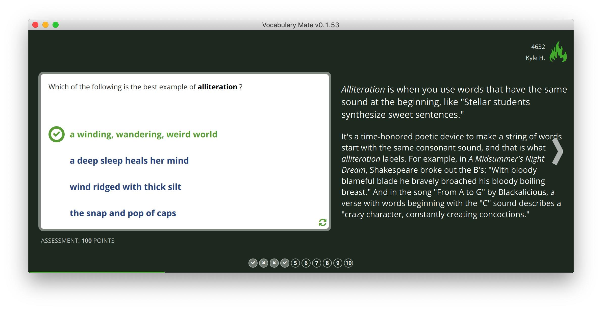

# Vocabulary Mate 


QML interface for  [Vocabulary.com](https://www.vocabulary.com/play/) games.

#### Binaries
Window / MacOSX are both supported. (Not for Linux now)

[Download Here](https://github.com/upday7/VocabMate/releases)

#### Run from Source

```bash
# Clone this repository
git clone https://github.com/upday7/VocabMate.git
cd VocabMate

# Install requirements
python3.6 pip -m install -r requirements.txt

# Run
python3.6 VocabMate.py
```

#### [Screenshots](_docs/screens)

 