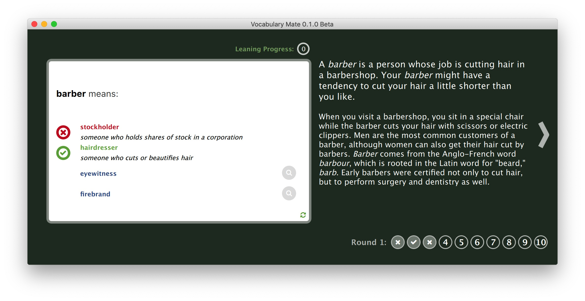
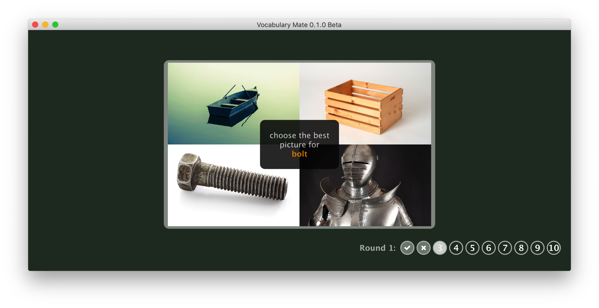
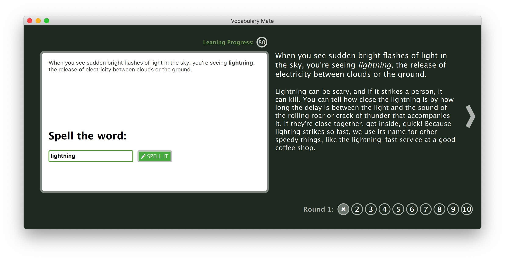

# Vocabulary Mate 

A QML front-end application for [Vocabulary.com](https://www.vocabulary.com/play/).

## Download
Download binaries at [download page](https://github.com/upday7/VocabMate/releases)

## Screenshots

